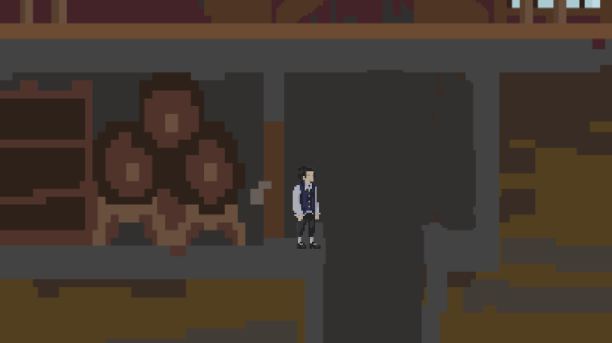

# TheWell

The Well.

This is a story about a simple guy - Michael, a young nobleman, who's family lost their estate.
He returns to the ruins of his family house to encounter the only possible source of his family's misfortune
(which is definitely has nothing to do with poor management and desperate desire to stick to dying traditions):
The Misterious Well in the basement.

The young Michael stands in front of a seemingly bottomless pit and stares at the wall for reasons known only to him.
Boredom? Justice? Because we made him to do so? We can but speculate.

This is a story about a man, who will do anything to achieve his goal. He will place a ladder, climb it, take it from under himself and fall down only to get stuck...

# ... in The Well.
